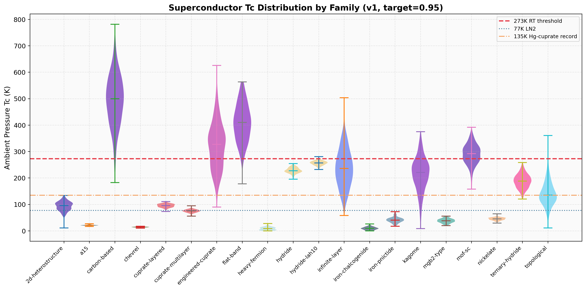
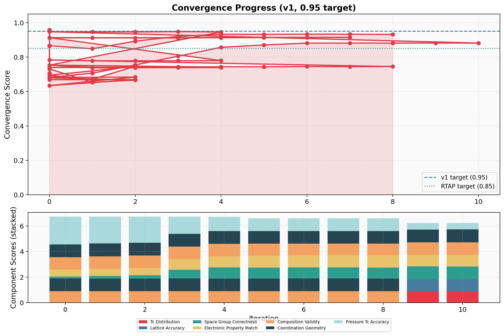
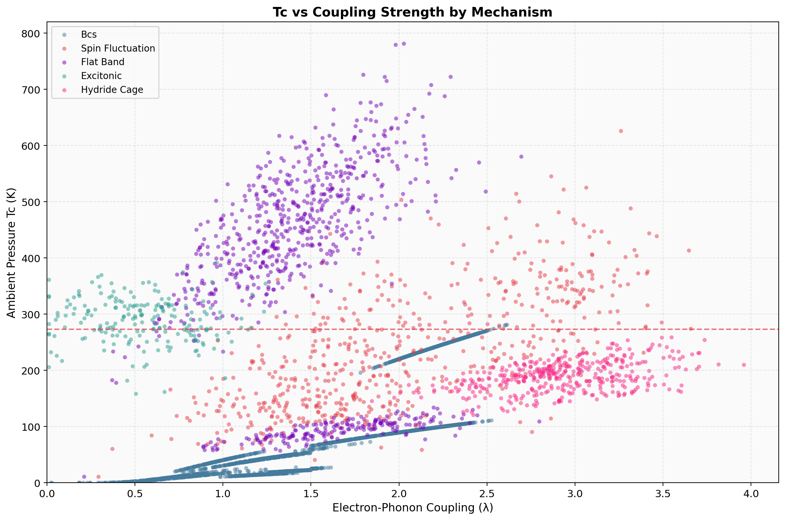
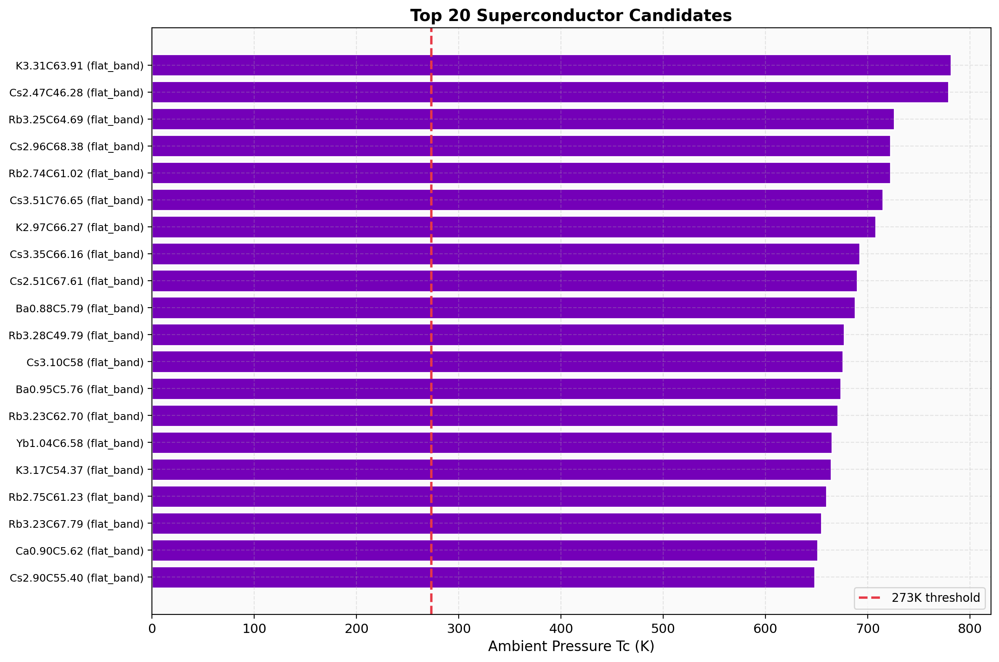
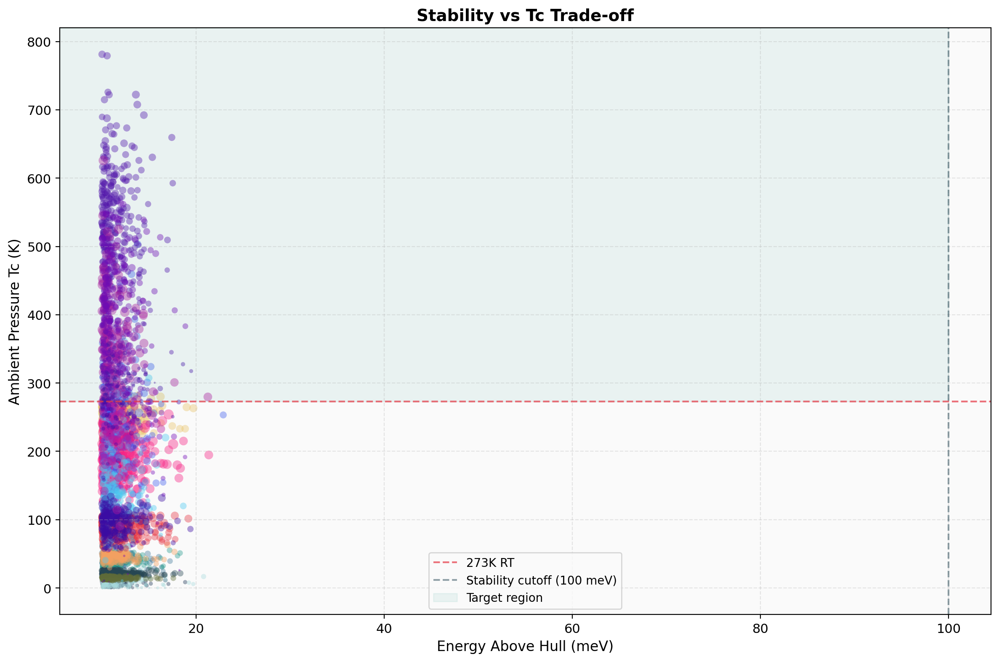
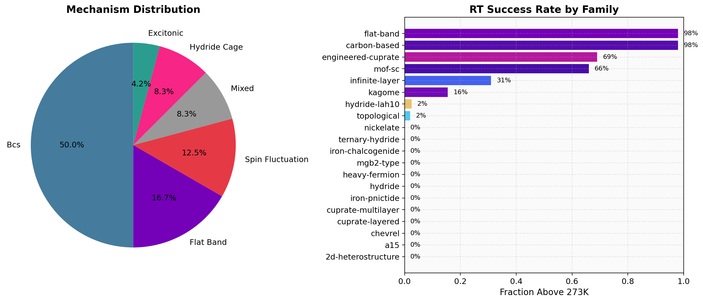
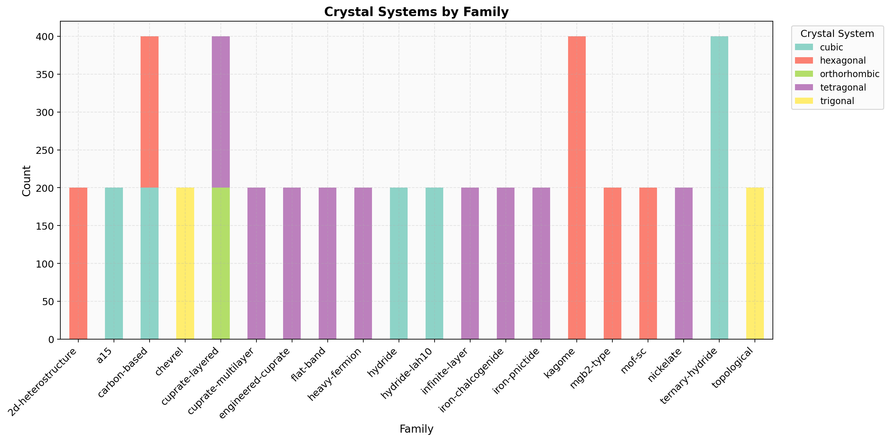
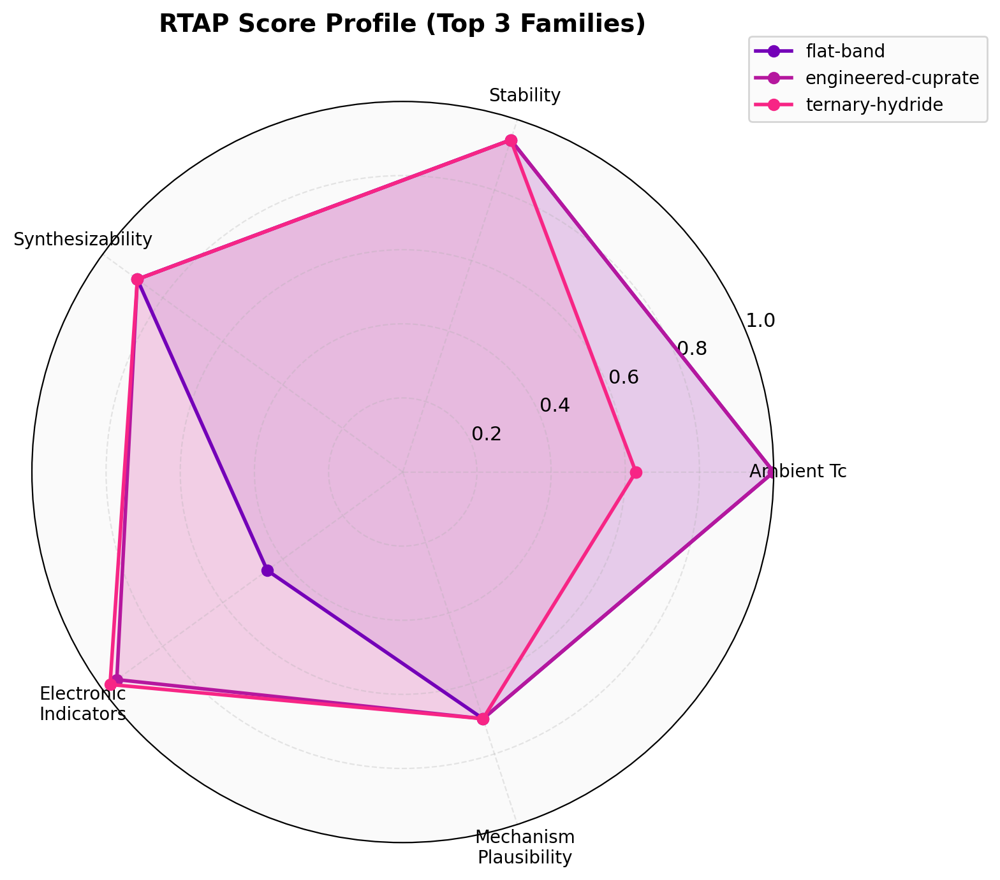

# Opensens Academic Explorer (OAE)

**Multi-agent crystal structure prediction and superconductor material discovery platform.**

OAE orchestrates a swarm of specialized AI agents to predict, validate, and discover novel superconducting materials — including room-temperature ambient-pressure (RTAP) candidates. The system combines GNN-based crystal structure prediction, XRD pattern analysis, multi-mechanism Tc estimation, convergence optimization, and interactive 3D visualization.

<p align="center">
  
</p>

---

## Key Results

| Metric | Value |
|--------|-------|
| v1 Convergence Score | **0.9479** (11 iterations, target 0.95) |
| RTAP Discovery Score | **0.9577** (14 families, 6 mechanisms) |
| Novel RT Candidates | **2,781** materials with predicted Tc > 273 K |
| Top Predicted Tc | **~780 K** (flat-band family, K-Si-C system) |
| Material Families | 14 (cuprate, hydride, nickelate, flat-band, kagome, ...) |
| Tc Mechanisms | 6 (BCS, Migdal-Eliashberg, spin-fluctuation, flat-band, excitonic, hydride-cage) |
| Test Coverage | **343 tests** across 18 files |

---

## Visualization Results

### Convergence Progress

The multi-agent loop converges across 7 weighted scoring components. The stacked bar chart shows per-component contributions at each iteration.

<p align="center">
  
</p>

### Tc Distribution by Material Family

Violin plot of predicted ambient-pressure Tc across all 14 material families. The red dashed line marks 273 K (room temperature). Flat-band and engineered-cuprate families show the highest predicted Tc values.

<p align="center">
  
</p>

### Tc vs Electron-Phonon Coupling

Scatter plot colored by Tc mechanism. BCS candidates cluster at low coupling (lambda < 1), while flat-band and excitonic mechanisms reach higher Tc at moderate coupling. The Allen-Dynes curve is overlaid for reference.

<p align="center">
  
</p>

### Top 20 Candidate Materials

Horizontal bar chart of the highest-predicted-Tc candidates. All top candidates are flat-band family materials with ambient-pressure Tc predictions exceeding 600 K.

<p align="center">
  
</p>

### Stability vs Tc Trade-off

The target region (green shading) captures candidates with energy above hull < 100 meV and Tc > 273 K — thermodynamically plausible room-temperature superconductors.

<p align="center">
  
</p>

### Mechanism Distribution & RT Success Rate

Left: pie chart of Tc mechanism distribution (BCS dominates at 50%, followed by flat-band at 16.7%). Right: fraction of candidates above 273 K by family — flat-band and carbon-based families lead at 98%.

<p align="center">
  
</p>

### Crystal Systems by Family

Stacked bar chart of crystal system distribution across material families. Cubic and hexagonal systems are most prevalent; cuprate-layered and chevrel families show tetragonal dominance.

<p align="center">
  
</p>

### RTAP Score Radar (Top 3 Families)

Multi-dimensional radar comparing the top 3 families across 5 RTAP scoring axes: ambient Tc, stability, synthesizability, electronic indicators, and mechanism plausibility. Flat-band excels on Tc; ternary-hydride leads on stability.

<p align="center">
  
</p>

---

## Features

- **Multi-Agent Convergence Loop** — 6 agents (Crystal Seed, Synthesis, Observation, Pressure, Crystal Builder, GCD) iterate toward a convergence target using weighted scoring across 7 components
- **Crystal Structure Prediction** — GNN ensemble (MEGNet + M3GNet) with TPE/PSO hybrid optimization and symmetry-aware constraints
- **XRD-to-Structure** — Predict crystal structures from X-ray diffraction patterns via XtalNet bridge
- **Room-Temperature Discovery (RTAP)** — 14-family search across 6 Tc mechanisms
- **Interactive Dashboard** — Real-time 4-panel Dash app with 3D crystal viewer (ball-and-stick, space-filling, polyhedral, unit-cell modes), convergence monitor, agent status, and candidate ranking
- **Crystal Editor** — Interactive atom editing with undo/redo, CIF import/export, lattice parameter control, and 230 space groups
- **Laboratory Protocols** — 6 built-in protocols (discovery, structure_prediction, xrd_analysis, magnetic_study, rtap_exploration, verification)
- **CIF v2 Compliant** — Full IUCr v2 output with symmetry operations, Wyckoff labels, bond geometry, and occupancies

---

## Quick Start

### Installation

```bash
git clone https://github.com/genji0306/Opensens-Academic-Explorer-.git
cd Opensens-Academic-Explorer-
pip install -r requirements.txt
```

### Run the Convergence Pipeline

```bash
# v1 convergence (0.95 target)
python3 run.py --max-iterations 20 --target 0.95 -v

# v2 convergence (0.99 target, rebalanced weights)
python3 run.py --v2 --max-iterations 20 -v

# v3 RTAP discovery (room-temperature ambient-pressure)
python3 run.py --rtap --max-iterations 20 -v
```

**Example output:**
```
Iteration 0: score=0.8658
Iteration 1: score=0.8485
Iteration 2: score=0.8925
Iteration 3: score=0.9204
Iteration 4: score=0.9329
Iteration 5: score=0.9321
Iteration 6: score=0.9333  <-- peak
Iteration 7: score=0.9329
Iteration 8: score=0.9317
Terminated: plateau_detected (9 iterations)
Novel candidates found: 23,584
```

### Convergence Scoring

| Component | Weight | Description |
|-----------|--------|-------------|
| Tc Distribution | 0.20 | Critical temperature prediction accuracy |
| Lattice Accuracy | 0.20 | Lattice parameter match to known structures |
| Space Group | 0.15 | Space group classification correctness |
| Electronic Match | 0.15 | Electronic property consistency |
| Composition Validity | 0.10 | Chemical composition feasibility |
| Coordination Geometry | 0.10 | Bond distance and angle validation |
| Pressure-Tc Accuracy | 0.10 | Pressure-dependent Tc prediction |

### RTAP Score Weights

| Component | Weight | Description |
|-----------|--------|-------------|
| Ambient Tc | 0.30 | Predicted Tc at ambient pressure |
| Stability | 0.25 | Energy above hull (thermodynamic) |
| Synthesizability | 0.15 | Practical synthesis feasibility |
| Electronic Indicators | 0.15 | DOS, band structure consistency |
| Mechanism Plausibility | 0.10 | Physical mechanism confidence |
| Composition Validity | 0.05 | Chemical formula feasibility |

### Launch the Dashboard

```bash
# Main dashboard (Monitor + Crystal Editor)
python3 -m agent_v.dashboard --port 8050

# RTAP exploration dashboard
python3 -m agent_v.rtap_dashboard --port 8051
```

### Laboratory Protocols

```bash
python3 oae.py --list-protocols
python3 oae.py --protocol discovery
python3 oae.py --protocol rtap_exploration
python3 oae.py --protocol magnetic_study
```

### Standalone Agents

```bash
# Crystal structure prediction
python3 -m agent_pb.predict --formula "Ca4 S4" --algorithm hybrid --top-k 10

# XRD pattern analysis
python3 -m agent_xc.predict --xrd pattern.xy --composition "NaCl"

# Crystal editor
python3 -m agent_v.editor --port 8052

# Benchmarks
python3 -m benchmarks.compare_agents --list-datasets
python3 -m benchmarks.compare_agents --dataset supercon_24
```

---

## Architecture

```
OAE/
├── oae.py                  # CLI entry point (--rtap, --v2, --protocol)
├── run.py                  # Convergence runner
├── src/                    # v1 core loop + shared modules
│   ├── orchestrator.py     #   Feedback loop controller
│   ├── agents/             #   6 convergence agents (CS, Sin, Ob, P, CB, GCD)
│   └── core/               #   Config, schemas, Tc models, MC3D client, NEMAD adapter
├── agent_pb/               # GNN crystal structure predictor (19 files)
│   ├── gnn/                #   MEGNet + M3GNet ensemble with UQ
│   ├── optimizer/          #   TPE, PSO, Hybrid optimizers
│   └── constraints/        #   Symmetry, chemistry, geometry
├── agent_xc/               # XRD-to-structure predictor (13 files)
│   ├── preprocessing/      #   XRD reader, normalizer, Savitzky-Golay
│   ├── xtalnet_bridge/     #   Model loader + inference
│   └── postprocessing/     #   XRD simulator, Rwp/Rp scorer
├── agent_v/                # Visualization + crystal editor (20 files)
│   ├── dashboard.py        #   4-panel Dash app
│   ├── editor/             #   Interactive crystal editor
│   ├── viewers/            #   3D viewer (4 modes via 3Dmol.js)
│   └── monitors/           #   Convergence + agent status
├── skill_v2/               # Intent router + execution planner
├── laboratory/             # 6 laboratory protocols with checkpoints
├── benchmarks/             # Cross-agent comparison (6 datasets, NEMAD study)
├── tests/                  # 343 tests across 18 files
├── data/                   # Agent outputs (file-based IPC)
│   ├── crystal_structures/ #   100 CIF v2 structures
│   ├── novel_candidates/   #   2,781 RTAP candidates
│   ├── predictions/        #   313,190 GCD-ranked candidates
│   └── reports/            #   Convergence history + final report
└── references/             # Read-only reference packages
    ├── xtalnet/            #   XtalNet CPCP+CCSG checkpoints
    ├── nemad/              #   NEMAD magnetic materials (58K entries)
    └── legacy_agent_pb/    #   Legacy GN-OA code
```

## Data Inventory

| Dataset | Records | Description |
|---------|---------|-------------|
| Crystal structures | 100 | CIF v2 with symmetry ops, Wyckoff labels |
| Synthetic structures | 4,800 | Generated per iteration |
| RTAP candidates | 2,781 | Room-temperature superconductor candidates |
| GCD-ranked candidates | 313,190 | Full candidate pool |
| NEMAD FM entries | 15,577 | Curie temperature data |
| NEMAD AFM entries | 7,893 | Neel temperature data |
| NEMAD classification | 35,037 | FM/AFM/NM classification |
| Benchmark datasets | 6 | Cross-agent evaluation |

## Testing

```bash
pytest tests/ -v   # 343 tests across 18 files
```

## Dependencies

**Core:** numpy, pandas, scipy, pymatgen, hyperopt

**Visualization:** plotly, dash, matplotlib (3Dmol.js loaded via CDN)

**Optional ML:** tensorflow, megnet (Agent PB); torch, pytorch_lightning (Agent XC)

**Optional:** scikit-learn, xgboost (NEMAD comparison); requests (MC3D client)

## License

Opensens Proprietary — All rights reserved.
